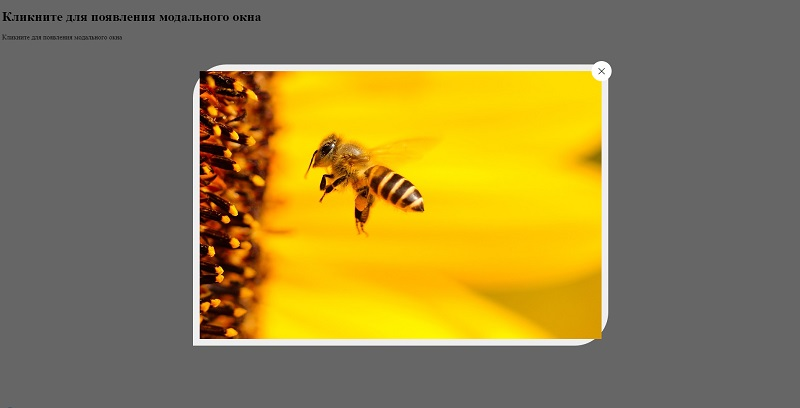

# modal-window

### Преимущества
---
- не нужны фреймворки и дополнительные библиотеки
- скрипт обёртнут в самовызывающуюся функцию
- возможность подключения встроенной анимации
- стили с учётом использования на мобильных устройствах
- простое подключение
- возможности для гибкой настройки
---
### [пример использования ➫](https://avavax.ru/src/1002/)
### Порядок установки
---
1. В код html вставить div.overlay со всем содержимым
2. Подключить sсript.js и style.css
3. Элементам, на которые нужно повесить окно, добавить атрибуты modal-win и data-img="путь к изображению"
4. Для анимации в div.modal-wrap добавить класс modal-animation
5. Стилизовать css по желанию

